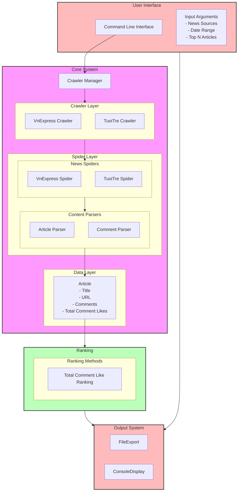

# Hot Articles Crawler Script

## Installation

1. Install dependencies using Poetry:
    ```sh
    poetry install
    ```

2. Init shell
    ```sh
    poetry shell
   ```

## Usage

1. To run the spider, use the following command:
    ```sh
   # run last 7 days (default)
     poetry run python main.py --crawler=vnexpress 
   
   # run from start_date to end_date
     poetry run python main.py --crawler=tuoitre --start_date=YYYY-MM-DD --end_date=YYYY-MM-DD
    ```

## Project Structure

- `pyproject.toml`: Configuration file for Poetry, including project dependencies.


